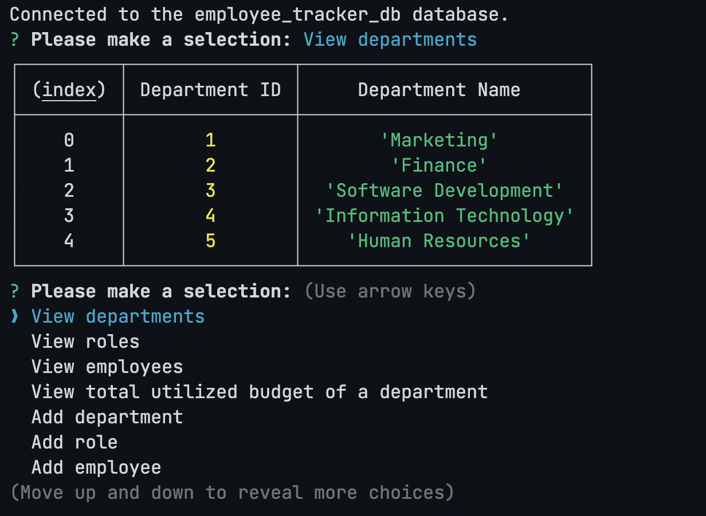

# Employee Tracker (CLI Tool)
[](https://choosealicense.com/licenses/mit/)


## Table of Contents

- [Description](#description)
- [Installation](#installation)
    + [Prerequisites](#prerequisites)
    + [How to install](#how-to-install)
- [Usage](#usage)
- [Credits](#credits)
- [License](#license)


## Description
Employee Tracker is a CLI content management system (CMS). The purpose of this tool is to manage a database of employees at your company. It's written in JavaScript and runs on **Node.js**. The **inquirer** and **mysql2** packages are the main dependenices (see [credits](#credits)). This application connects to a MySQL database. When you run it you will be presented with choices that include creating, reading, updating, and deleting information from the CMS. The data is displayed in a table in the console.

Here's a preview of the application:
<br>


## Installation
### Prerequisites
You must have **node.js** installed to run this application. I highly recommend using [**nvm**](https://github.com/nvm-sh/nvm) (node version manager) to manage your node.js installation.
<br>
This application is based on **node v16.18.1**.

### How to install
After you ensure that you have **node.js** installed you can simply clone this repositry:
```
git clone git@github.com:jakubcic/employee-tracker.git
```

Then in your terminal navigate to the root of the `employee-tracker` directory and run `npm install`.

## Usage
Once you have everything installed, including the dependencies, you can run `node index.js` in your terminal within the employee-tracker directory and the application will launch and begin prompting you. 
<br>

Here's a video demo

[insert video here]


## Credits
### Dependencies
This application uses v8.2.5 of the [inquirer](https://www.npmjs.com/package/inquirer/v/8.2.5) package and v2.3.3 of the [mysql2](https://www.npmjs.com/package/mysql2) package. 

### External Code
Within my `addEmployee` function I encountered a bug caused by MySQL. I need to make a nested query to get the `id` of the manager based on the manager name because of a MySQL 1093 error. I found the workaround on [stackoverflow](https://stackoverflow.com/a/9843719/9367208), though this potentially has a performance impact and that's something to consider.
<br>

I was originally using the built-in `console.table` to display the tables of data after the user chose one of the view options but I didn't like how it had an index column for every table. I considered that to be a waste of space in your terminal and a bad user experience. I found this neat function on [stackoverflow](https://stackoverflow.com/a/69874540/9367208) that will display a table given an array of data, but remove the index value. I added it as a helper function inside `./helpers`. 

## License
This application is covered under the [MIT License](https://choosealicense.com/licenses/mit/).


